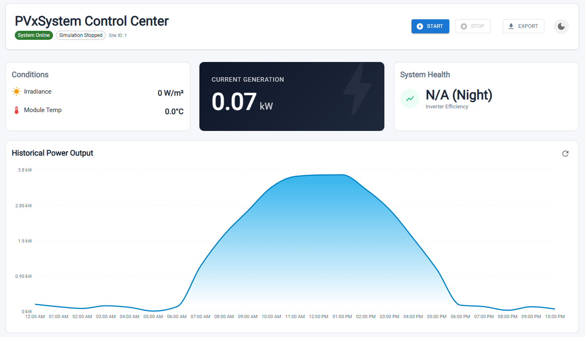
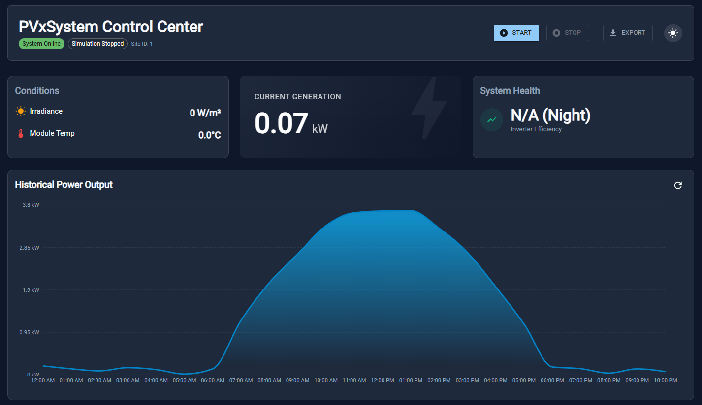

# PVxSystem
PVxSystem е информационна система за управление и мониторинг на енергия от възобновяеми източници, със специален фокус върху фотоволтаични (PV) системи.  
Информационната истема позволява наблюдение на текущото състояние, симулация на производството на енергия, събиране и анализ на исторически данни, както и визуализация на мощност, метеорологични условия и ефективност на инверторите в реално време.

Основни характеристики на PVxSystem:
- **Мониторинг в реално време** на енергийното производство от PV панели.
- **Исторически данни и симулации** за анализ на производителността.
- **Интерактивен дашборд**
- **Възможност за експорт на данни** в Excel формат за по-задълбочени анализи.
- **WebSocket интеграция** за получаване на live данни и известия за състоянието на симулациите.

## Снимки

- **Светъл режим**  

- **Тъмен режим**  

## Използвани инструменти и библиотеки
Front-end файловете са събрани в: `/src/client`
Back-end файловете са в: `/src/server`

[Упътване за настройване и използване](./src/README.md)

## API
За повече информация прочете: [Backend README](./src/server/README.md)

### Телеметрия
- `GET /sites/:id/telemetry` – извлича исторически данни по зададен период.
  - Query параметри: `from`, `to`, `limit`
- `GET /sites/:id/simulate/status` – връща статуса на симулацията (дали тя е активна).

### Симулатор
- `POST /sites/:id/simulate/start` – стартира симулация на системата.
  - Тяло: `{ intervalMs?: number, startFrom?: string }`
- `POST /sites/:id/simulate/stop` – спира симулацията.
- `POST /sites/:id/simulate/seed` – генерира голям брой данни за определен период от време.
  - Тяло: `{ points?: number }`
- `DELETE /sites/:id/simulate/clear` – изтрива всички генерирани данни в базата от данни.

### WebSocket
- Поддържа live обновления на симулацията.

## Клиентска част
- Диаграма и полета за визуализация на данни.
- Управление на симулация на виртуална PV система (стартиране/спиране).
- Показване на текущи данни във вид на диаграма.
- Експортиране на данни в Excel формат.

## Документация
В директорията `docs` може да намерите подробна информация за информационната система.
В поддиректория `database` се намират:
- Диаграма на връзките между таблиците (`DB_PVxSystem.pdf`)
- SQL скрипт за създаване на БД (`DB_PVxSystemSQL.sql`)
- Документация за БД (`DB_PVxSystem_Documentation.pdf`)

## Принос
Може да използвате "Pull requests" за дребни промени и подобрения.

При по-значителни промени, моля, първо отворете "issue", за да обсъдим какво бихте искали да промените.
